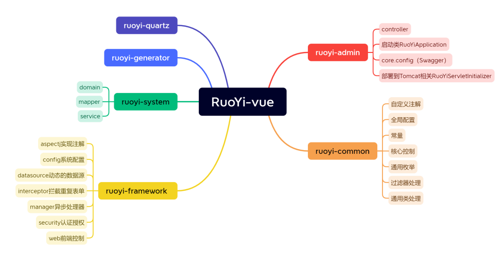
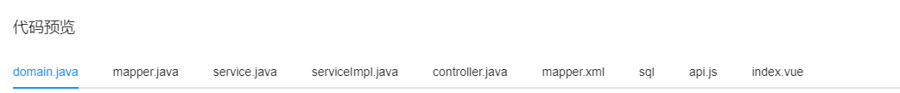
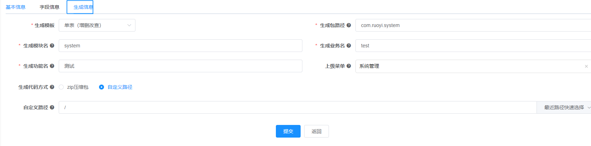
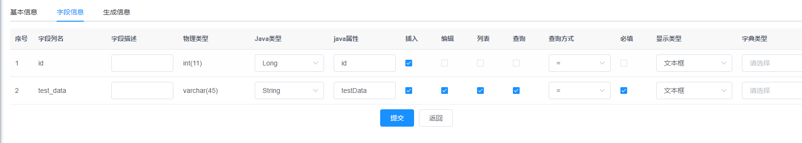
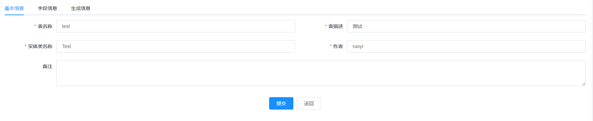

# RuoYi-Vue
若依官网：http://ruoyi.vip

演示地址：http://demo.ruoyi.vip

代码下载：https://gitee.com/y_project/RuoYi

&nbsp;&nbsp;&nbsp;*整理框架内容*
### 框架结构：
## 一、登录模块
### 获取验证码
首先访问前端getcode()方法，通过反向代理解决跨域访问到后端的captchaImage():
页面就绪后获取验证码图片以及对应的uuid作为redis访问验证码的key：
```
    getCode() {
      getCodeImg().then(res => {
        this.captchaEnabled = res.captchaEnabled === undefined ? true : res.captchaEnabled;
        if (this.captchaEnabled) {
          this.codeUrl = "data:image/gif;base64," + res.img;
          this.loginForm.uuid = res.uuid;
        }
      });
    }
```
访问/captchaImage对应路径后端方法：
```
export function getCodeImg() {
  return request({
    url: '/captchaImage',
    headers: {
      isToken: false
    },
    method: 'get',
    timeout: 20000
  })
}
```
插入url公共部分并向后端发送请求：
```
const service = axios.create({
  // axios中请求配置有baseURL选项，表示请求URL公共部分
  baseURL: process.env.VUE_APP_BASE_API,
  // 超时
  timeout: 10000
})
```
反向代理：
```
devServer: {
    host: '0.0.0.0',
    port: port,
    open: true,
    proxy: {
      // detail: https://cli.vuejs.org/config/#devserver-proxy
      [process.env.VUE_APP_BASE_API]: {
        target: `http://localhost:8080`,
        changeOrigin: true,
        pathRewrite: {
          ['^' + process.env.VUE_APP_BASE_API]: ''
        }
      }
    },
    disableHostCheck: true
  }
  ```

#### 后端代码

~~~
    @GetMapping("/captchaImage")
    public AjaxResult getCode(HttpServletResponse response) throws IOException
    {
        AjaxResult ajax = AjaxResult.success();
        boolean captchaEnabled = configService.selectCaptchaEnabled();
        ajax.put("captchaEnabled", captchaEnabled);
        if (!captchaEnabled)
        {
            return ajax;
        }

        // 保存验证码信息
        String uuid = IdUtils.simpleUUID();
        String verifyKey = CacheConstants.CAPTCHA_CODE_KEY + uuid;

        String capStr = null, code = null;
        BufferedImage image = null;

        // 生成验证码
        String captchaType = RuoYiConfig.getCaptchaType();
        if ("math".equals(captchaType))
        {
            String capText = captchaProducerMath.createText();
            capStr = capText.substring(0, capText.lastIndexOf("@"));
            code = capText.substring(capText.lastIndexOf("@") + 1);
            image = captchaProducerMath.createImage(capStr);
        }
        else if ("char".equals(captchaType))
        {
            capStr = code = captchaProducer.createText();
            image = captchaProducer.createImage(capStr);
        }

        redisCache.setCacheObject(verifyKey, code, Constants.CAPTCHA_EXPIRATION, TimeUnit.MINUTES);
        // 转换流信息写出
        FastByteArrayOutputStream os = new FastByteArrayOutputStream();
        try
        {
            ImageIO.write(image, "jpg", os);
        }
        catch (IOException e)
        {
            return AjaxResult.error(e.getMessage());
        }

        ajax.put("uuid", uuid);
        ajax.put("img", Base64.encode(os.toByteArray()));
        return ajax;
    }

~~~
首先创建一个AjaxResult对象用于向前端返回消息数据：
~~~
    AjaxResult ajax = AjaxResult.success();
~~~
~~~
    public static AjaxResult success(String msg, Object data)
       {
           return new AjaxResult(HttpStatus.SUCCESS, msg, data);
       }
~~~
接着通过uuid生成将要存入redis中的key，读取配置采用“char”或者“math”的不同方式通过封装的不同验证码生成器生成不同的验证码：
~~~
    if ("math".equals(captchaType))
        {
            String capText = captchaProducerMath.createText();
            capStr = capText.substring(0, capText.lastIndexOf("@"));
            code = capText.substring(capText.lastIndexOf("@") + 1);
            image = captchaProducerMath.createImage(capStr);
        }
        else if ("char".equals(captchaType))
        {
            capStr = code = captchaProducer.createText();
            image = captchaProducer.createImage(capStr);
        }
~~~
之后通过Ajax输出到前端。
### 登录提交
首先先判断是否勾选Remember me，勾选就将信息存入cookie，没有勾选就将cookie记录删除：
~~~
        if (this.loginForm.rememberMe) {
            Cookies.set("username", this.loginForm.username, { expires: 30 });
            Cookies.set("password", encrypt(this.loginForm.password), { expires: 30 });
            Cookies.set('rememberMe', this.loginForm.rememberMe, { expires: 30 });
          } else {
            Cookies.remove("username");
            Cookies.remove("password");
            Cookies.remove('rememberMe');
          }
~~~
接着通过同样的方式去访问后端/login路径下方法,login方法第一步先验证验证码，通过uuid查到redis中验证码与code比较，如果失败则采用异步的方式记录日志并抛出异常：
~~~
            String verifyKey = CacheConstants.CAPTCHA_CODE_KEY + StringUtils.nvl(uuid, "");
            String captcha = redisCache.getCacheObject(verifyKey);
            redisCache.deleteObject(verifyKey);
            if (captcha == null)
            {
                AsyncManager.me().execute(AsyncFactory.recordLogininfor(username, Constants.LOGIN_FAIL, MessageUtils.message("user.jcaptcha.expire")));
                throw new CaptchaExpireException();
            }
            if (!code.equalsIgnoreCase(captcha))
            {
                AsyncManager.me().execute(AsyncFactory.recordLogininfor(username, Constants.LOGIN_FAIL, MessageUtils.message("user.jcaptcha.error")));
                throw new CaptchaException();
            }
~~~
之后通过Spring Security进行认证，认证完毕后记录日志并更新用户登录信息表：
~~~
recordLoginInfo(loginUser.getUserId());
~~~
最后通过TokenService生成一个token，通过token生成key将loginUser存入redis，通过Jwt生成返回token，返回个前端。
~~~
public String createToken(LoginUser loginUser)
    {
        String token = IdUtils.fastUUID();
        loginUser.setToken(token);
        setUserAgent(loginUser);
        //根据token将loginUser缓存到redis
        refreshToken(loginUser);

        Map<String, Object> claims = new HashMap<>();
        claims.put(Constants.LOGIN_USER_KEY, token);
        return createToken(claims);
    }
~~~
### 总结
1，生成并校验验证码。
2，校验用户名密码，更新登录用户信息。
3，生成token存入用户信息并将用户信息更新到redis，向前端返回token。
## 二、获取登录用户信息
### GetInfo
每进入一个页面，前端都会调用一次getInfo方法，方法首先通过SecurityContextHolder获得到登录的loginUser对象，接着获取用户全部角色信息和权限信息，最后返回到前端存储到VueX。
~~~
@GetMapping("getInfo")
    public AjaxResult getInfo()
    {
        SysUser user = SecurityUtils.getLoginUser().getUser();
        // 角色集合
        Set<String> roles = permissionService.getRolePermission(user);
        // 权限集合
        Set<String> permissions = permissionService.getMenuPermission(user);
        AjaxResult ajax = AjaxResult.success();
        ajax.put("user", user);
        ajax.put("roles", roles);
        ajax.put("permissions", permissions);
        return ajax;
    }
~~~
### GetRouters
根据当前权限获取动态路由菜单。
首先根据userId查到所有相关的menus再进行行整理返回：
~~~
if (SecurityUtils.isAdmin(userId))
        {
            menus = menuMapper.selectMenuTreeAll();
        }
        else
        {
            menus = menuMapper.selectMenuTreeByUserId(userId);
        }
        return getChildPerms(menus, 0);
~~~
获取父节点将父节点返回，父节点包含子节点：
~~~
public List<SysMenu> getChildPerms(List<SysMenu> list, int parentId)
    {
        List<SysMenu> returnList = new ArrayList<SysMenu>();
        for (Iterator<SysMenu> iterator = list.iterator(); iterator.hasNext();)
        {
            SysMenu t = (SysMenu) iterator.next();
            // 根据传入的某个父节点ID,遍历该父节点的所有子节点
            //并存储高级父节点
            if (t.getParentId() == parentId)
            {
                //传入全部节点和父节点，在全部节点中寻找下级节点
                recursionFn(list, t);
                returnList.add(t);
            }
        }
        return returnList;
    }
~~~
层层递归遍历设置父节点的子节点：
~~~
private void recursionFn(List<SysMenu> list, SysMenu t)
    {
        // 得到子节点列表，并给父节点设置子节点列表
        List<SysMenu> childList = getChildList(list, t);
        t.setChildren(childList);
        //遍历子节点列表，如果子节点不是最低节点，递归执行搜寻子节点。
        for (SysMenu tChild : childList)
        {
            if (hasChild(list, tChild))
            {
                recursionFn(list, tChild);
            }
        }
    }
~~~
menus对象中存放着路由路径。
## 三、用户管理
流程：加载用户页面->请求后台数据：
页面中获取数据方法：
~~~
created() {
    this.getList();
    this.getDeptTree();
    this.getConfigKey("sys.user.initPassword").then(response => {
      this.initPassword = response.msg;
    });
  },
~~~
### 1、getlist()

~~~
    @PreAuthorize("@ss.hasPermi('system:user:list')")
    @GetMapping("/list")
    public TableDataInfo list(SysUser user)
    {
        startPage();
        List<SysUser> list = userService.selectUserList(user);
        return getDataTable(list);
    }
~~~
#### 权限
方法首先通过@PreAuthorize注解进行了权限控制：
~~~
@Service("ss")
public class PermissionService
~~~
自定义权限类，当判断是否有某权限前，先取出用户信息，用户信息为空或者无任何权限都直接返回false，接着通过：
~~~
PermissionContextHolder.setContext(permission);
~~~
将想要判断的权限注册进PermissionContextHolder中在其他地方使用，最后返回
~~~
    private boolean hasPermissions(Set<String> permissions, String permission)
    {
        return permissions.contains(ALL_PERMISSION) || permissions.contains(StringUtils.trim(permission));
    }
~~~
判断是否有权限。
#### startPage()
方法一开始封装了分页方法startPage()：
~~~
    public static void startPage()
    {
        PageDomain pageDomain = TableSupport.buildPageRequest();
        Integer pageNum = pageDomain.getPageNum();
        Integer pageSize = pageDomain.getPageSize();
        String orderBy = SqlUtil.escapeOrderBySql(pageDomain.getOrderBy());
        Boolean reasonable = pageDomain.getReasonable();
        PageHelper.startPage(pageNum, pageSize, orderBy).setReasonable(reasonable);
    }
~~~
首先创建一个PageDomain对象用于从请求中获取分页相关数据信息，然后传递给PageHelper完成动态织入Mybatis的SQL语句完成分页。setReasonable(reasonable)方法用于保证参数正确性，若出现逻辑不正确参数可自动改成正确参数。其中TableSupport.buildPageRequest();封装了创建PageDomain的方法：
~~~
    public static PageDomain getPageDomain()
    {
        PageDomain pageDomain = new PageDomain();
        pageDomain.setPageNum(Convert.toInt(ServletUtils.getParameter(PAGE_NUM), 1));
        pageDomain.setPageSize(Convert.toInt(ServletUtils.getParameter(PAGE_SIZE), 10));
        pageDomain.setOrderByColumn(ServletUtils.getParameter(ORDER_BY_COLUMN));
        pageDomain.setIsAsc(ServletUtils.getParameter(IS_ASC));
        pageDomain.setReasonable(ServletUtils.getParameterToBool(REASONABLE));
        return pageDomain;
    }
~~~
#### selectUserList(user)
~~~
    @Override
    @DataScope(deptAlias = "d", userAlias = "u")
    public List<SysUser> selectUserList(SysUser user)
    {
        return userMapper.selectUserList(user);
    }
~~~
~~@DataScope(deptAlias = "d", userAlias = "u")用于给数据库表设置别名，dept表设置为d，user表设置为u。~~
最后返回查询数据给前端：
~~~
    protected TableDataInfo getDataTable(List<?> list)
    {
        TableDataInfo rspData = new TableDataInfo();
        rspData.setCode(HttpStatus.SUCCESS);
        rspData.setMsg("查询成功");
        rspData.setRows(list);
        rspData.setTotal(new PageInfo(list).getTotal());
        return rspData;
    }
~~~
前端进行接收
~~~
        this.userList = response.rows;
        this.total = response.total;
~~~
### 2、getDeptTree()
~~~
@PreAuthorize("@ss.hasPermi('system:user:list')")
    @GetMapping("/deptTree")
    public AjaxResult deptTree(SysDept dept)
    {
        return success(deptService.selectDeptTreeList(dept));
    }
~~~
进入deptService查看方法，首先获取到AOP代理对象，通过代理对象查询到全部数据`List<SysDept> depts = SpringUtils.getAopProxy(this).selectDeptList(dept);`之后返回整理成前端需要的树结构的对象`return buildDeptTreeSelect(depts);`。
~~~
    @Override
    public List<TreeSelect> buildDeptTreeSelect(List<SysDept> depts)
    {
        List<SysDept> deptTrees = buildDeptTree(depts);
        //将泛型换成前端需要的类型，简化对象，丢掉不要的属性。
        return deptTrees.stream().map(TreeSelect::new).collect(Collectors.toList());
    }
~~~
#### 部门单击事件
~~~
   // 节点单击事件
    handleNodeClick(data) {
      this.queryParams.deptId = data.id;
      this.handleQuery();
    }
~~~
`handleQuery()`中复用了前面`getList()`方法，但是传入了部门id的参数。
### 3、新增/修改数据
#### 获取新增表单
~~~
handleAdd() {
      this.reset();
      getUser().then(response => {
        this.postOptions = response.posts;
        this.roleOptions = response.roles;
        this.open = true;
        this.title = "添加用户";
        this.form.password = this.initPassword;
      });
    }
~~~
第一步`reset()`用于表单重置清空表单中的信息，`getUser()`用于回填岗位和角色，实现下拉表单。定位到后端controller
~~~
    @PreAuthorize("@ss.hasPermi('system:user:query')")
    @GetMapping(value = { "/", "/{userId}" })
    public AjaxResult getInfo(@PathVariable(value = "userId", required = false) Long userId)
    {
        userService.checkUserDataScope(userId);
        AjaxResult ajax = AjaxResult.success();
        List<SysRole> roles = roleService.selectRoleAll();
        ajax.put("roles", SysUser.isAdmin(userId) ? roles : roles.stream().filter(r -> !r.isAdmin()).collect(Collectors.toList()));
        ajax.put("posts", postService.selectPostAll());
        if (StringUtils.isNotNull(userId))
        {
            SysUser sysUser = userService.selectUserById(userId);
            ajax.put(AjaxResult.DATA_TAG, sysUser);
            ajax.put("postIds", postService.selectPostListByUserId(userId));
            ajax.put("roleIds", sysUser.getRoles().stream().map(SysRole::getRoleId).collect(Collectors.toList()));
        }
        return ajax;
    }
~~~
这个方法被修改和新增操作共用，第一步`userService.checkUserDataScope(userId);`用于判断要修改的用户是否被允许访问用户数据，若不能被访问则抛出异常。随后通过Ajax对象向前端发送角色和岗位信息，并在角色中通过判断`SysUser.isAdmin(userId) ? roles : roles.stream().filter(r -> !r.isAdmin()).collect(Collectors.toList()));`来决定传入的角色是否包含admin角色。之后判断是否为修改方法，若为修改方法怎向表单传入要修改用户的当前信息。
#### 提交表单
~~~
submitForm: function() {
      this.$refs["form"].validate(valid => {
        if (valid) {
          if (this.form.userId != undefined) {
            updateUser(this.form).then(response => {
              this.$modal.msgSuccess("修改成功");
              this.open = false;
              this.getList();
            });
          } else {
            addUser(this.form).then(response => {
              this.$modal.msgSuccess("新增成功");
              this.open = false;
              this.getList();
            });
          }
        }
      });
    },
~~~
首先判断表单是否含有userId确定是修改还是新增方法。找到新增后端方法：
~~~
    @PreAuthorize("@ss.hasPermi('system:user:add')")
    @Log(title = "用户管理", businessType = BusinessType.INSERT)
    @PostMapping
    public AjaxResult add(@Validated @RequestBody SysUser user)
    {
        if (!userService.checkUserNameUnique(user))
        {
            return error("新增用户'" + user.getUserName() + "'失败，登录账号已存在");
        }
        else if (StringUtils.isNotEmpty(user.getPhonenumber()) && !userService.checkPhoneUnique(user))
        {
            return error("新增用户'" + user.getUserName() + "'失败，手机号码已存在");
        }
        else if (StringUtils.isNotEmpty(user.getEmail()) && !userService.checkEmailUnique(user))
        {
            return error("新增用户'" + user.getUserName() + "'失败，邮箱账号已存在");
        }
        user.setCreateBy(getUsername());
        user.setPassword(SecurityUtils.encryptPassword(user.getPassword()));
        return toAjax(userService.insertUser(user));
    }
~~~
很简单的一个新增操作，判断信息有效性然后设置创建者和编码密码。其中insertUser事务操作包含了增加用户，增加用户角色关系，新增用户岗位关系三个新增操作（用户和角色，用户和岗位在数据库是多对多关系）。
~~~
    @Override
    @Transactional
    public int insertUser(SysUser user)
    {
        // 新增用户信息
        int rows = userMapper.insertUser(user);
        // 新增用户岗位关联
        insertUserPost(user);
        // 新增用户与角色管理
        insertUserRole(user);
        return rows;
    }
~~~
#### 获取修改用户表单
~~~
    handleUpdate(row) {
      this.reset();
      const userId = row.userId || this.ids;
      getUser(userId).then(response => {
        this.form = response.data;
        this.postOptions = response.posts;
        this.roleOptions = response.roles;
        this.$set(this.form, "postIds", response.postIds);
        this.$set(this.form, "roleIds", response.roleIds);
        this.open = true;
        this.title = "修改用户";
        this.form.password = "";
      });
    },
~~~
获取表单的方法和新增共用一个路径方法，返回全部岗位角色信息同时还会获取要修改用户的用户信息。
#### 提交表单
修改数据后端方法：
~~~
    @PreAuthorize("@ss.hasPermi('system:user:edit')")
    @Log(title = "用户管理", businessType = BusinessType.UPDATE)
    @PutMapping
    public AjaxResult edit(@Validated @RequestBody SysUser user)
    {
        userService.checkUserAllowed(user);
        userService.checkUserDataScope(user.getUserId());
        if (!userService.checkUserNameUnique(user))
        {
            return error("修改用户'" + user.getUserName() + "'失败，登录账号已存在");
        }
        else if (StringUtils.isNotEmpty(user.getPhonenumber()) && !userService.checkPhoneUnique(user))
        {
            return error("修改用户'" + user.getUserName() + "'失败，手机号码已存在");
        }
        else if (StringUtils.isNotEmpty(user.getEmail()) && !userService.checkEmailUnique(user))
        {
            return error("修改用户'" + user.getUserName() + "'失败，邮箱账号已存在");
        }
        user.setUpdateBy(getUsername());
        return toAjax(userService.updateUser(user));
    }
~~~
这个方法是Put方法而添加数据的方法为Post方法。
>PUT 请求通常用于更新或替换服务器上的资源，而 POST 请求通常用于创建新的资源或提交数据到服务器进行处理。

这个方法首先判断要修改的用户信息是否允许被修改已经是否有被访问允许，然后同样是一系列信息有效性判断。最后对用户信息设置修改人并调用封装的updateUser方法进行修改操作，其中修改方法：
~~~
    @Override
    @Transactional
    public int updateUser(SysUser user)
    {
        Long userId = user.getUserId();
        // 删除用户与角色关联
        userRoleMapper.deleteUserRoleByUserId(userId);
        // 新增用户与角色管理
        insertUserRole(user);
        // 删除用户与岗位关联
        userPostMapper.deleteUserPostByUserId(userId);
        // 新增用户与岗位管理
        insertUserPost(user);
        return userMapper.updateUser(user);
    }
~~~
可见updateUser方法对于角色和岗位的改动是使用的是先删后新增的策略。`insertUserRole(user);`方法复用了新增操作时的方法，将User对象转化为SynUserRole对象。
### 4、删除数据
前端方法：
~~~
    handleDelete(row) {
      const userIds = row.userId || this.ids;
      this.$modal.confirm('是否确认删除用户编号为"' + userIds + '"的数据项？').then(function() {
        return delUser(userIds);
      }).then(() => {
        this.getList();
        this.$modal.msgSuccess("删除成功");
      }).catch(() => {});
    },
~~~
后端delete方法：
~~~
    @PreAuthorize("@ss.hasPermi('system:user:remove')")
    @Log(title = "用户管理", businessType = BusinessType.DELETE)
    @DeleteMapping("/{userIds}")
    public AjaxResult remove(@PathVariable Long[] userIds)
    {
        if (ArrayUtils.contains(userIds, getUserId()))
        {
            return error("当前用户不能删除");
        }
        return toAjax(userService.deleteUserByIds(userIds));
    }
~~~
首先判断是否要删除自己登录用户，若包括自己账号则抛出异常。进入`userService.deleteUserByIds(userIds)`方法：
~~~
    public int deleteUserByIds(Long[] userIds)
    {
        for (Long userId : userIds)
        {
            checkUserAllowed(new SysUser(userId));
            checkUserDataScope(userId);
        }
        // 删除用户与角色关联
        userRoleMapper.deleteUserRole(userIds);
        // 删除用户与岗位关联
        userPostMapper.deleteUserPost(userIds);
        return userMapper.deleteUserByIds(userIds);
    }
~~~
方法首先判断要删除的用户是否有被操作的允许和被访问的允许，之后先删除用户角色表和用户岗位表的数据，再删除用户表的数据。删除用户表操作采用的是逻辑删除。
补充：`@Log(title = "用户管理", businessType = BusinessType.DELETE)`用于记录数据库操作日志到数据库。
## 四，异步任务管理器
示例：`AsyncManager.me().execute(AsyncFactory.recordLogininfor(username, Constants.LOGIN_FAIL, MessageUtils.message("user.password.not.match")));`
首先`AsyncManager.me()`获取单例对象实例，执行`executer()`传入一个实现了Runnable接口的TimmTask对象，由内部封装的Scheduled线程池对象按照设置好的延时去调度。
其中线程池获取代码：`private ScheduledExecutorService executor=SpringUtils.getBean("scheduledExecutorService");`通过Spring工具类获取名字为“scheduledExecutorService”的Bean。即为：
~~~
    @Bean(name = "scheduledExecutorService")
    protected ScheduledExecutorService scheduledExecutorService()
    {
        return new ScheduledThreadPoolExecutor(corePoolSize,
                new BasicThreadFactory.Builder().namingPattern("schedule-pool-%d").daemon(true).build(),
                new ThreadPoolExecutor.CallerRunsPolicy())
        {
            @Override
            protected void afterExecute(Runnable r, Throwable t)
            {
                super.afterExecute(r, t);
                Threads.printException(r, t);
            }
        };
    }
~~~
该Bean创建线程池时设置了核心线程数量，线程工厂（自定义了线程名字，开启了守护线程）和任务超出线程池容量时的应对方法。
***总得来说就是封装了一个线程池。***
## 五、代码自动生成
1、在数据库中创建数据表
2、在页面生成，生成结果浏览：

可以生成对应实体类，mapper，service，controller，生成menu的sql，以及前端入口。
3、对生成代码进一步编辑操作。



4、点击生成代码下载代码
5、导入代码重启项目
## 六、导入导出功能
